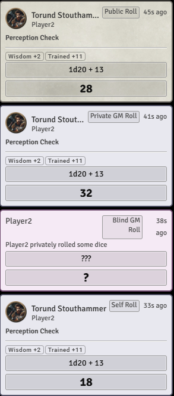
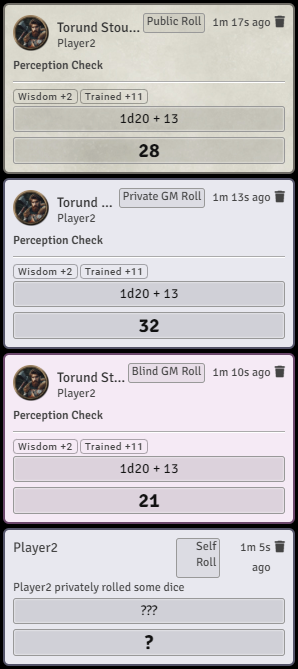
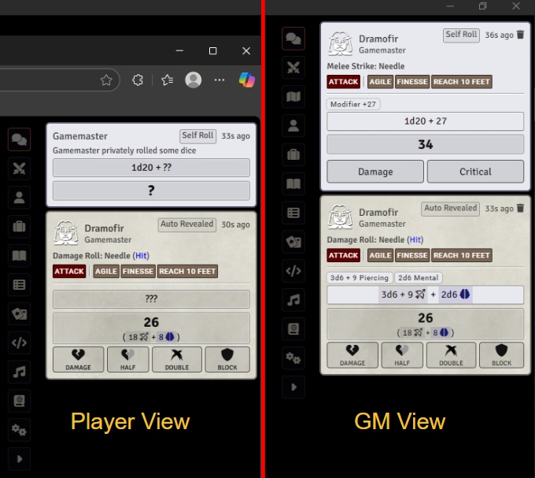

# Chat Indicators+

Adds a text tag to chat messages to easily identify whether the message is a whisper, blind roll, GM roll, or self roll.
| Player's View | GM's View |
| ------------- | ------------- |
|  |  |

There is also an option to automatically reveal Player rolled heals or GM Damage rolls

## Confirmed System Compatibility
* PF2e
-----
Inspired by Chat "Message Accessibility Indicators" which was archived by the owner on Dec 3, 2021
